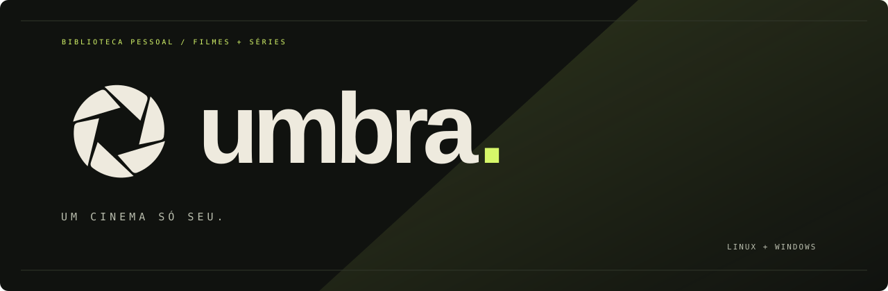
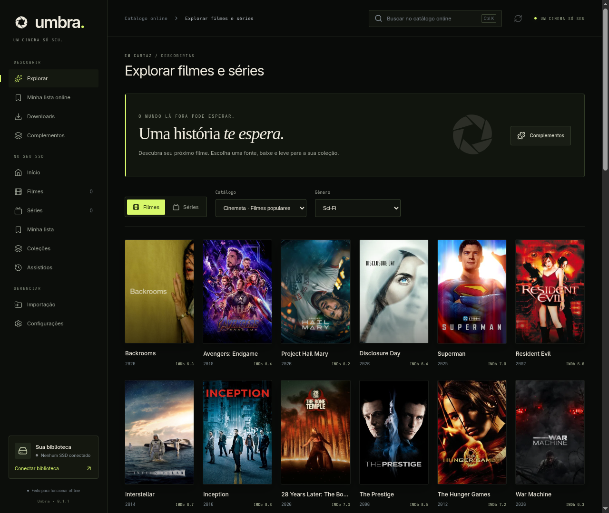

<p align="center"></p>

<p align="center">
  <a href="https://github.com/AugustodoBRT/Umbra/actions/workflows/build.yml"></a>
  <a href="LICENSE"></a>
  
  
</p>

**Sua coleção, suas avaliações, seu próximo play.** Umbra reúne filmes e séries em uma biblioteca pessoal, com uma identidade escura inspirada em salas de cinema. O vídeo toca dentro do aplicativo; você escolhe o áudio, a legenda e o volume sem abrir outro player.

<p align="center"><a href="https://github.com/AugustodoBRT/Umbra/releases">Baixar para Windows</a> · <a href="docs/USAGE.md">Guia de uso</a> · <a href="ARCHITECTURE.md">Como funciona</a></p>



## O que tem no Umbra

- **Player integrado:** pausa, busca, áudio, legendas embutidas ou próximas ao vídeo, volume, velocidade, tela cheia com controles que somem e retomada. Personalize tamanho, cor, fundo, contorno e posição das legendas de texto.
- **Uma biblioteca sua:** pastas locais ou SSD externo, importação por seletor, filmes, temporadas, episódios, busca e filtros.
- **Metadados em português:** sinopses e gêneros via TMDB, mantendo títulos originais. Configure sua chave no app; a coleção funciona sem ela.
- **Seu registro de cinema:** notas, resenhas, favoritos, listas e histórico de assistidos.
- **Exclusão com histórico:** apagar um título libera o espaço dos vídeos. Obras assistidas permanecem no histórico; obras não assistidas saem do catálogo. O limite de conclusão é ajustável.
- **Explorar e baixar:** catálogo online e complementos compatíveis com o protocolo Stremio, fontes por filme ou temporada, fila com pausa e retomada.
- **Dados portáteis:** catálogo e imagens acompanham sua pasta de vídeos; as chaves e os links privados ficam no computador.

## Instalar no Windows

**Windows 10/11, x64.** Baixe os arquivos na [página de Releases](https://github.com/AugustodoBRT/Umbra/releases).

| Arquivo | Quando usar |
| --- | --- |
| `Umbra-<versão>-x64-nsis.exe` | Instalar com atalho no menu e escolher a pasta de instalação. |
| `Umbra-<versão>-x64-portable.exe` | Abrir sem instalar. O perfil de configurações fica neste computador. |

1. Execute o instalador ou a versão portable e abra **Umbra**.
2. Em **Início → Conectar minha biblioteca**, selecione sua pasta de vídeos. Pode ser `C:\Users\Você\Videos\Cinema`, outro disco ou um SSD externo.
3. Aguarde a importação, abra um título e clique em **Assistir**.

**Não depende do meu SSD.** O aplicativo abre sem biblioteca conectada e não tem um caminho de vídeos fixo. Electron, FFmpeg, ffprobe e o motor torrent estão incluídos: não é necessário instalar Node.js, Python, mpv ou Stremio. A primeira versão é distribuída sem assinatura de código; o Windows pode exibir “editor desconhecido”.

As builds Windows são produzidas pelo GitHub Actions e verificadas com o **aplicativo empacotado**, vídeo sintético, faixas de áudio, legenda, retomada, exclusão e downloads de filme e temporada em uma pasta vazia. Veja o resultado na aba [Actions](https://github.com/AugustodoBRT/Umbra/actions). Os hashes dos executáveis acompanham cada release em `SHA256SUMS.txt`.

## Executar no Linux

Para executar pelo código, instale **Node.js 24+** e **FFmpeg/ffprobe**. Downloads torrent também precisam de **Python 3 + libtorrent**; o catálogo e vídeos locais funcionam sem esse motor.

```bash
# Arch Linux
sudo pacman -S nodejs npm ffmpeg python-libtorrent

# Ubuntu/Debian
sudo apt install ffmpeg python3-libtorrent python-is-python3
# Instale Node.js 24+ antes dos comandos abaixo.
```

```bash
git clone https://github.com/AugustodoBRT/Umbra.git
cd Umbra
npm ci
npm run build
npm start
```

O Electron fornecido pelo npm é usado quando não há `/usr/bin/electron`. Para escolher outro runtime, use `CINESSD_ELECTRON`. A distribuição Linux empacotada ainda não foi validada; `npm run package:linux` gera uma pasta para testes.

## Desenvolver e gerar o instalador

```bash
npm ci
npm run dev
```

```bash
npm test                  # armazenamento, importação, metadados, downloads e reprodução
npm run build             # TypeScript + build Electron/React
npm run test:player       # player real dentro do Electron
npm run test:desktop      # biblioteca, avaliações, exclusões e histórico
npm run test:online       # catálogo e downloads sintéticos
```

Os testes gráficos precisam de uma sessão desktop; no Linux CI, use `xvfb-run -a`. Toda mídia usada nas verificações é sintética, com bibliotecas temporárias. Nenhum filme do usuário acompanha o projeto.

O print do Explorar usa títulos e pôsteres reais do Cinemeta. Para refazê-lo após o build, execute `node --import tsx scripts/capture-explore.ts` em uma sessão desktop com acesso à internet; a captura usa um perfil temporário.

No **Windows x64**, com Node.js 24+ e Python 3.12 para construir:

```powershell
npm ci
python -m pip install -r packaging/windows/requirements.txt
npm run prepare:windows
npm run package:windows
npm run test:windows
```

Os executáveis ficam em `release/`. O preparo baixa uma versão fixa do FFmpeg, verifica SHA-256 e constrói o worker torrent independente. [O workflow](.github/workflows/build.yml) repete esse processo e publica releases apenas depois dos testes Linux e Windows passarem.

## Reprodução e dados

MP4 H.264/AAC compatível toca diretamente. MKV e outros formatos usam conversão durante a sessão, **sem modificar o arquivo original**, com saída até 1080p. A conversão pode exigir mais CPU. HDR, áudio multicanal por passthrough e fidelidade de efeitos ASS ainda não foram validados. Não há autoplay do próximo episódio.

O Umbra cria `Biblioteca/` dentro da pasta selecionada para guardar catálogo, imagens e backups. Caminhos de vídeos são relativos, permitindo mover a coleção. Ao levar a biblioteca para outro computador, selecione novamente a pasta e configure suas próprias chaves. Para bloqueios após interrupções, backups e exclusões, consulte [o guia de uso](docs/USAGE.md).

A interface é em português, com paleta preto, ivório e verde luminoso. [A marca e a prancha de identidade](assets/brand/README.md) acompanham o código. Identificadores internos `cinessd` foram mantidos para preservar perfis e bibliotecas anteriores.

## Licenças e fontes

Código do Umbra sob [MIT](LICENSE). Ferramentas e dados externos mantêm suas próprias licenças; veja [THIRD_PARTY.md](THIRD_PARTY.md). As distribuições Windows incluem avisos do FFmpeg e do motor torrent.

This product uses the TMDB API but is not endorsed or certified by TMDB.

[TMDB](https://www.themoviedb.org/) · [OMDb](https://www.omdbapi.com/) · [Cinemeta](https://github.com/Stremio/stremio-cinemeta) · [Protocolo Stremio](https://stremio.github.io/stremio-addon-sdk/protocol.html)
